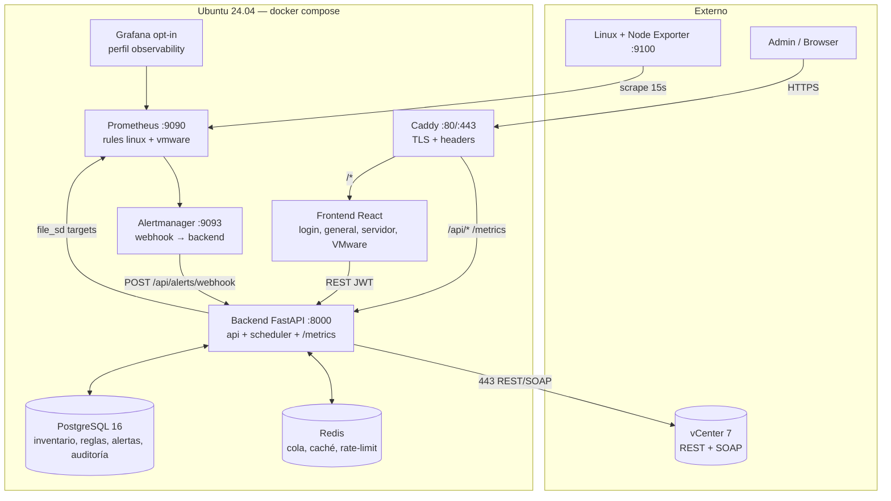
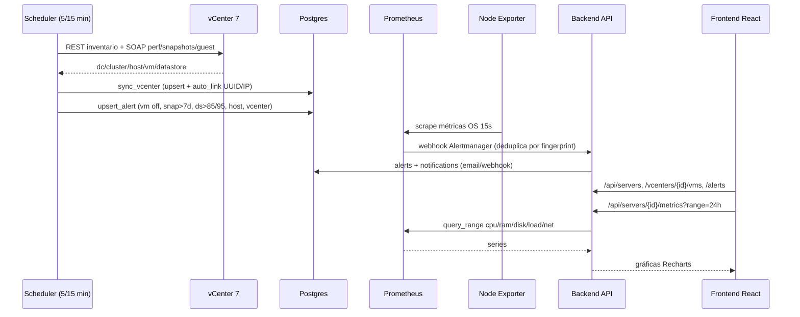
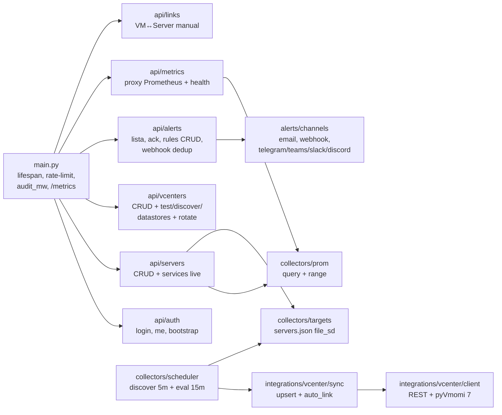

# Diagramas — Monitoreo SRV (implementado)

## 1. Componentes y contenedores

```mermaid
graph TB
  subgraph ext[Externo]
    VC[(vCenter 7<br/>REST + SOAP)]
    LX[Linux + Node Exporter :9100]
    ADM[Admin / Browser]
  end
  subgraph host[Ubuntu 24.04 — docker compose]
    CADDY[Caddy :80/:443<br/>TLS + headers]
    FE[Frontend React<br/>login, general, servidor, VMware]
    API[Backend FastAPI :8000<br/>api + scheduler + /metrics]
    PG[(PostgreSQL 16<br/>inventario, reglas, alertas, auditoría)]
    RD[(Redis<br/>cola, caché, rate-limit)]
    PROM[Prometheus :9090<br/>rules linux + vmware]
    AM[Alertmanager :9093<br/>webhook → backend]
    GRAF[Grafana opt-in<br/>perfil observability]
  end
  ADM -->|HTTPS| CADDY
  CADDY -->|/api/* /metrics| API
  CADDY -->|/*| FE
  FE -->|REST JWT| API
  LX -->|scrape 15s| PROM
  API -->|file_sd targets| PROM
  API -->|443 REST/SOAP| VC
  API <--> PG
  API <--> RD
  PROM --> AM
  AM -->|POST /api/alerts/webhook| API
  GRAF --> PROM
```

## 2. Flujo de datos (discovery → métrica → alerta)

```mermaid
sequenceDiagram
  participant S as Scheduler (5/15 min)
  participant V as vCenter 7
  participant DB as Postgres
  participant P as Prometheus
  participant N as Node Exporter
  participant B as Backend API
  participant F as Frontend React
  S->>V: REST inventario + SOAP perf/snapshots/guest
  V-->>S: dc/cluster/host/vm/datastore
  S->>DB: sync_vcenter (upsert + auto_link UUID/IP)
  S->>DB: upsert_alert (vm off, snap>7d, ds>85/95, host, vcenter)
  N->>P: scrape métricas OS 15s
  P->>B: webhook Alertmanager (deduplica por fingerprint)
  B->>DB: alerts + notifications (email/webhook)
  F->>B: /api/servers, /vcenters/{id}/vms, /alerts
  F->>B: /api/servers/{id}/metrics?range=24h
  B->>P: query_range cpu/ram/disk/load/net
  P-->>B: series
  B-->>F: gráficas Recharts
```

## 3. Módulos del backend

```mermaid
graph LR
  MAIN[main.py<br/>lifespan, rate-limit,<br/>audit_mw, /metrics] --> AUTH[api/auth<br/>login, me, bootstrap]
  MAIN --> SRV[api/servers<br/>CRUD + services live]
  MAIN --> VC[api/vcenters<br/>CRUD + test/discover/<br/>datastores + rotate]
  MAIN --> AL[api/alerts<br/>lista, ack, rules CRUD,<br/>webhook dedup]
  MAIN --> MET[api/metrics<br/>proxy Prometheus + health]
  MAIN --> LNK[api/links<br/>VM↔Server manual]
  SCHED[collectors/scheduler<br/>discover 5m + eval 15m] --> SYNC[integrations/vcenter/sync<br/>upsert + auto_link]
  SYNC --> CLIENT[integrations/vcenter/client<br/>REST + pyVmomi 7]
  MET --> PROMQ[collectors/prom<br/>query + range]
  SRV --> PROMQ
  AL --> CH[alerts/channels<br/>email, webhook,<br/>telegram/teams/slack/discord]
  SCHED --> TGT[collectors/targets<br/>servers.json file_sd]
  SRV --> TGT
```
